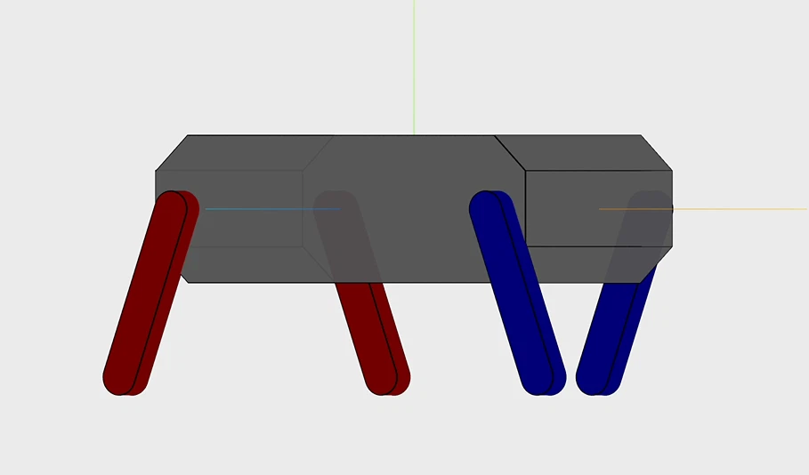

# tweeny-web

Tweeny is an ESP-32 based, 4-servo-only quadruped robot that can walk and perform actions.
`tweeny-web` is the web interface for Tweeny, which enables the user to control Tweeny from a web browser or use LLM to control it.

